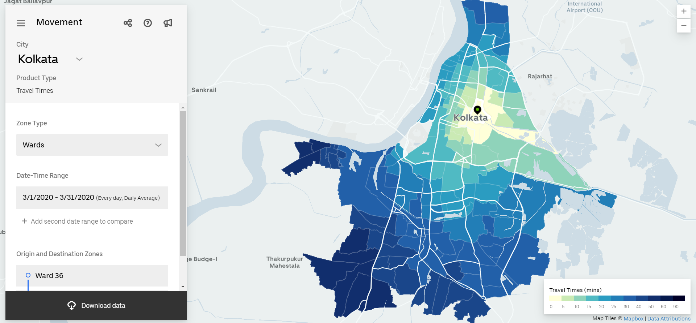

# **Computing Travel time in Kolkata using Uber Movement data**
This is my final project for IDCE 30274: Programming for GIS where I use a tutorial to predict travel times in my home town, Kolkata in India. 

I use aggreagted travel time data  for the first quarter from the first quarter of 2020 from the Here is an image on what the city of Kolkata, India looks like using the [Uber Movement](https://movement.uber.com/explore/kolkata/travel-times/query?si=128&ti=&ag=wards&dt[tpb]=ALL_DAY&dt[wd;]=1,2,3,4,5,6,7&dt[dr][sd]=2019-12-01&dt[dr][ed]=2019-12-31&cd=&sa;=&sdn=&lang=en-US). 
> 

## Python pacakages used
- [Pandas](https://pandas.pydata.org/): To read the `.csv` file containing travel time data.
- [Geopandas](https://geopandas.org/): To read the `.json` file containing data on city boundaries. 
- [Shapely](https://pypi.org/project/Shapely/): To analyze city boundaries. 
- [Matplotlib](https://matplotlib.org/): To display city boundaries.

## To code along you will need:
- A Google account or a Python IDE. I use Colab, but this project uses a LOT of ram on your google drive, so it would be better to use a [Jupyter Notebook](https://jupyter.org/). 
- Travel time data and city boundaries from the city of your choice using [Uber Movement](https://movement.uber.com/?lang=en-US). The city boundary for Kolkata is avaialble in this repository as [kolkata_wards.json](https://github.com/NayantaraB/Travel_Time_Predictions/blob/main/kolkata_wards.json), but the travel time data was too large to upload and should be downloaded by the user. 

## Documentation:
All codes and description is provided in the that can be downloaded from [kolkata_wards.json](https://github.com/NayantaraB/Travel_Time_Predictions/blob/main/kolkata_wards.json) in this repository and used directly in your preferred coding environmnet. 

# Credit
This tutorial was inspired by a spatial data science/modelling tutorial on Travel Time Predictions by [Ujval Gandhi](https://github.com/spatialthoughts).
